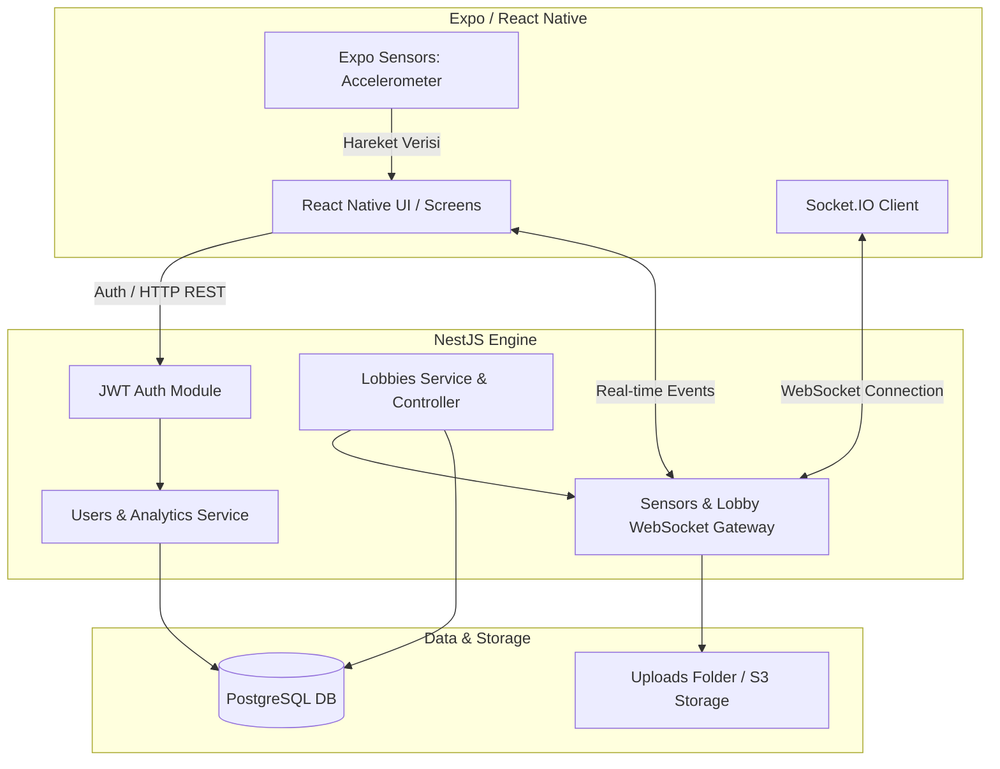
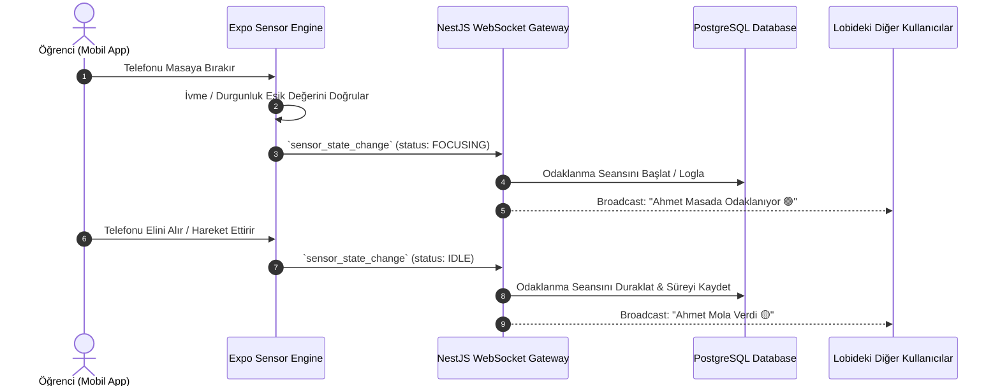

# 🎓 StudyLounge — Sensör Tabanlı Sosyal Odaklanma Platformu

> **"Ayrı Masalarda, Aynı Lobide."**

[](https://nestjs.com/)
[](https://expo.dev/)
[](https://www.typescriptlang.org/)
[](https://www.postgresql.org/)
[](https://www.docker.com/)
[](https://github.com/features/actions)
[](https://render.com/)

---

## 📌 Proje Hakkında

**StudyLounge**, evde veya kütüphanede tek başına ders çalışırken yaşanan yalnızlık, motivasyon kaybı ve dikkat dağılması sorunlarına yenilikçi bir çözüm sunan **mezuniyet projesi (portfolyo)** çalışmasıdır.

### 💡 Temel Çözüm ve Felsefe
Geleneksel sanal çalışma odalarında kamera açma zorunluluğu mahremiyet endişesi yaratmaktadır. **StudyLounge**, akıllı telefonların dahili **ivmeölçer (accelerometer)** ve **jiroskop (gyroscope)** sensörlerini kullanarak kullanıcının masada odaklanıp odaklanmadığını otomatik algılar.

- 🔕 **Tam Mahremiyet:** Kamera veya mikrofon kullanılmaz.
- 📱 **Sensör Tabanlı Algılama:** Telefon masaya bırakıldığında çalışma süresi otomatik başlar, telefon ele alındığında duraklatılır.
- 🤝 **Akademik Dayanışma:** Çalışma odasındaki (lobi) arkadaşlara küçük durum göstergeleri ve ışıklarla "Birlikte çalışıyoruz" hissi aktarılır.

---

## 🎨 Marka Kimliği ve Tasarım Dili

StudyLounge, öğrenci dostu, odaklanmayı teşvik eden sakin ve modern bir görsel dille tasarlanmıştır.

| Eleman | Seçim | Açıklama |
| :--- | :--- | :--- |
| **Ana Renk** | `#1A237E` *(Deep Indigo)* | Güven, odaklanma ve akademik derinlik hissi |
| **Yardımcı Renk** | `#FFC107` *(Amber)* | Enerji, motivasyon ve başarı vurgusu |
| **Tipografi** | `Montserrat` | Geometrik, okunabilir ve modern sans-serif |
| **Tasarım İlkesi** | Soft Dark Mode & Minimalizm | Göz yormayan, uzun çalışma seanslarına uygun arayüz |

---

## 📐 Sistem Mimarisi ve Veri Akışı

Uygulama; katmanlı mimari, mikro ölçekli WebSocket event'leri ve TypeORM veri kalıcılığı üzerine kurulmuştur.



### 🔄 Sensör Tabanlı Odak Takip Akışı



---

## 🛠️ Teknoloji Yığını (Tech Stack)

### 🔴 Backend (`/backend`)
- **Framework:** NestJS (Node.js / TypeScript)
- **Veritabanı & ORM:** PostgreSQL & TypeORM
- **Gerçek Zamanlı İletişim:** WebSockets via Socket.IO
- **Kimlik Doğrulama:** JWT (JSON Web Tokens) & Passport.js
- **Doğrulama & Güvenlik:** Class-Validator, Helmet, CORS Policies
- **Test:** Jest (Unit Tests & E2E Integration Tests)

### 📱 Mobile (`/mobile`)
- **Framework:** React Native (Expo SDK)
- **Dil:** TypeScript
- **Sensör Entegrasyonu:** `expo-sensors` (`Accelerometer`, `Gyroscope`)
- **Durum Yönetimi & HTTP:** React Hooks, Axios / Custom Fetch Wrapper
- **Stil & Arayüz:** Custom Color Tokens (`#1A237E`, `#FFC107`), Custom Components

### 🐳 DevOps, CI/CD & Cloud Infrastructure
- **Containerization:** Multi-stage Dockerfile & Docker Compose Orchestration
- **CI/CD Pipeline:** GitHub Actions (Automated Jest Tests, E2E Tests, Typecheck, Lint)
- **Cloud Hosting:** Render Web Service (Automated Docker Deployment)
- **Versiyon Kontrol:** Git & GitHub

---

## ✨ Temel Özellikler

1. 🎯 **Sensör Tabanlı Otomatik Çalışma Algılama:**
   - Telefon masaya bırakıldığında odaklanma sayacı kendiliğinden çalışır.
   - Telefonla oynamaya başlandığında veya hareket ettirildiğinde oturum otomatik duraklatılır.

2. 🚪 **Canlı Çalışma Lobileri (Study Lobbies):**
   - Genel, Özel ve Elite lobiler oluşturma ve katılma.
   - Odadaki katılımcıların anlık durumlarını (Odaklanıyor / Boşta) canlı izleme.

3. 💬 **Lobi Sohbeti & Görsel/Dosya Paylaşımı:**
   - Lobi üyeleri arasında anlık mesajlaşma.
   - Çalışma materyali, not ve görsel yükleme desteği.

4. 👋 **Nudge (Dürtme) & Sosyal Etkileşim:**
   - Arkadaş ekleme ve arkadaşların canlı durumunu görme.
   - Derse davet etmek için arkadaşlara tek tıkla anlık "Dürtme 👋" bildirimi gönderme.

5. 📊 **Analitik & Liderlik Tablosu (Leaderboard):**
   - Günlük, haftalık ve aylık toplam odaklanma süreleri grafiksel analizi.
   - Odaklanma sürelerine göre rütbe kazanma ve sıralamada yükselme.

---

## 🐳 DevOps & Deployment Mühendisliği

StudyLounge projesi, modern DevOps prensiplerine uygun olarak konteynerize edilmiş ve sürekli entegrasyon (CI/CD) hatları ile desteklenmiştir.

### 1. 📦 Multi-Stage Docker Mimarisi (`backend/Dockerfile`)
Üretim ortamında minimum imaj boyutu ve yüksek güvenlik için Multi-Stage Build yapısı tercih edilmiştir:

```dockerfile
# Stage 1: Build Aşaması
FROM node:20-alpine AS builder
WORKDIR /app
COPY package*.json ./
RUN npm ci
COPY . .
RUN npm run build

# Stage 2: Production Aşaması
FROM node:20-alpine
WORKDIR /app
COPY --from=builder /app/node_modules ./node_modules
COPY --from=builder /app/dist ./dist
COPY --from=builder /app/package.json ./
EXPOSE 3000
CMD [ "npm", "run", "start:prod" ]
```

### 2. 🐙 Docker Compose Yapılandırması (`docker-compose.yml`)
PostgreSQL veritabanı ile backend servisinin bağımlılıkları `healthcheck` mekanizması ile izole edilmiştir. Veritabanı tamamen hazır olmadan backend başlatılmaz:

```yaml
services:
  postgres:
    image: postgres:15
    container_name: studylounge_db
    environment:
      POSTGRES_USER: ${DB_USER:-enes_admin}
      POSTGRES_PASSWORD: ${DB_PASSWORD:-studylounge_secret}
      POSTGRES_DB: ${DB_NAME:-studylounge}
    ports:
      - "5432:5432"
    volumes:
      - postgres_data:/var/lib/postgresql/data
    healthcheck:
      test: ["CMD-SHELL", "pg_isready -U ${DB_USER:-enes_admin} -d ${DB_NAME:-studylounge}"]
      interval: 5s
      timeout: 5s
      retries: 5

  backend:
    build:
      context: ./backend
      dockerfile: Dockerfile
    container_name: studylounge_backend
    ports:
      - "3000:3000"
    environment:
      - DB_HOST=postgres
      - DB_PORT=5432
      - JWT_SECRET=docker-secret-key-123
    depends_on:
      postgres:
        condition: service_healthy
```

### 3. ⚙️ GitHub Actions CI/CD Pipeline (`.github/workflows/ci.yml`)
Her `push` ve `pull_request` adımlarında otomatik test ve doğrulama süreçleri tetiklenir:

- **Backend Job:** `npm ci` ➔ `npm run build` ➔ Jest Unit Testleri ➔ E2E Entegrasyon Testleri (`npm run test:e2e`).
- **Mobile Job:** `npm ci` ➔ TypeScript Tip Kontrolü (`tsc --noEmit`) ➔ ESLint Statik Kod Analizi.

### 4. 🌐 Cloud Deployment (Render Web Service)
Projenin canlı sunucu dağıtımı **Render** platformu üzerinde Docker runtime kullanılarak gerçekleştirilmiştir:
- **Binding:** Backend `0.0.0.0` IP adresi ve dinlenebilir port (`PORT`) üzerinden dış dünyaya açılmıştır.
- **CORS Yönetimi:** Production ortamında dinamik `CORS_ORIGIN` değişkeni ile güvenli origin yapılandırması sağlanır.
- **Environment Variables:** `JWT_SECRET`, `DB_HOST`, `DB_PORT`, `DB_USER`, `DB_PASSWORD`, `DB_NAME` ortam değişkenleri cloud secrets üzerinden beslenmektedir.

---

## 🚀 Kurulum ve Lokal Çalıştırma

### 📋 Ön Gereksinimler
- **Node.js**: `v20.x` veya üzeri
- **Docker & Docker Compose** (Opsiyonel: Yerel PostgreSQL de kullanılabilir)
- **Expo Go App** (Mobil testler için Android/iOS cihaz)

---

### 1️⃣ Repository'i Klonlayın
```bash
git clone https://github.com/kullanici-adi/studylounge.git
cd studylounge
```

---

### 2️⃣ Docker ile Veritabanı ve Backend'i Çalıştırın (Tavsiye Edilen)
Tek bir komutla hem PostgreSQL veritabanını hem de NestJS backend servisini konteynerize olarak kaldırabilirsiniz:

```bash
docker compose up --build -d
```
Backend ayağa kalktığında `http://localhost:3000/health` (veya sunucu IP adresiniz) üzerinden durum kontrolü yapabilirsiniz.

---

### 3️⃣ Alternatif: Backend'i Lokal Olarak Çalıştırma

```bash
cd backend
npm install
cp .env.example .env
# .env dosyasını veritabanı bilgilerinize göre düzenleyin
npm run start:dev
```

---

### 4️⃣ Mobil Uygulamayı Çalıştırma (Expo)

Mobil cihazınızın bilgisayarınızdaki backend'e erişebilmesi için yerel ağ (Wi-Fi) IP adresinizi belirtmeniz gerekmektedir:

```bash
cd mobile
npm install

# Windows PowerShell için:
$env:EXPO_PUBLIC_BACKEND_URL="http://192.168.x.x:3000"; npx expo start

# Linux/macOS için:
EXPO_PUBLIC_BACKEND_URL=http://192.168.x.x:3000 npx expo start
```
*Not: `192.168.x.x` yerine bilgisayarınızın yerel IP adresini yazınız.*

---

## 🛡️ Repo Hijyeni ve Güvenlik Standartları

- 🔐 **Ortam Değişkenleri İzolasyonu:** Şifreler, API key'leri ve `JWT_SECRET` bilgileri kesinlikle versiyon kontrolüne (Git) eklenmez; `.env.example` şablonları kullanılır.
- 🛡️ **Gelişmiş DTO Validasyonu:** NestJS `ValidationPipe` ile gelen tüm payload'lar `whitelist: true` ve `forbidNonWhitelisted: true` kurallarıyla filtreler.
- 📂 **Statik Dosya Yönetimi:** Kullanıcı avatarları ve yüklenen notlar `/uploads` dizininde izole tutulur (Production için AWS S3 / Cloudinary mimarisi ile uyumludur).

---

## 👨‍💻 İletişim

- 👤 **Geliştirici:** Enes İlbay
- 📧 **E-Posta:** enesilbayy@gmail.com
- 🔗 **LinkedIn:** [https://www.linkedin.com/in/enes-ilbay/]
- 🐙 **GitHub:** [@enesilbay](https://github.com)

---

<p align="center">
  <sub>StudyLounge — Ayrı Masalarda, Aynı Lobide.</sub>
</p>
