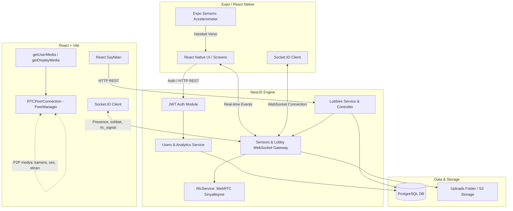
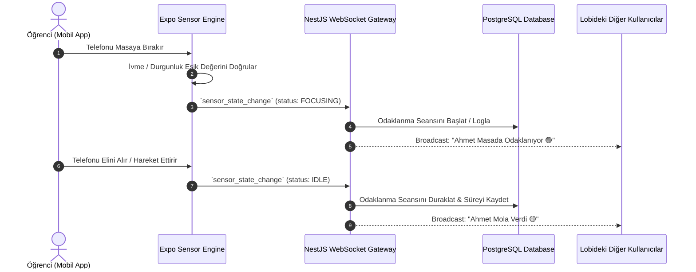
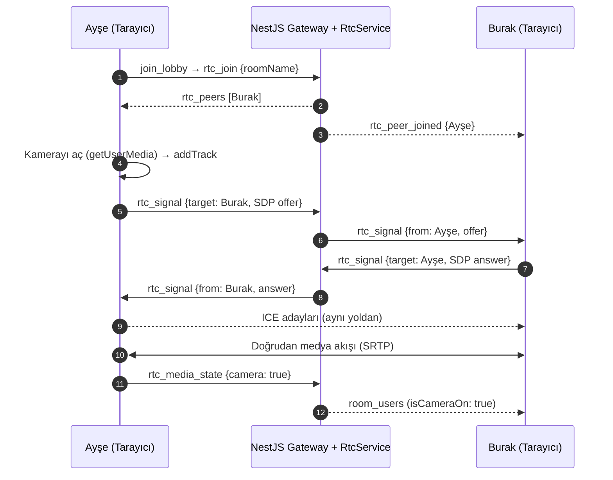

# 🎓 StudyLounge — Sosyal Odaklanma Platformu (Mobil + Web)

> **"Ayrı Masalarda, Aynı Lobide."**

[](https://nestjs.com/)
[](https://expo.dev/)
[](https://vite.dev/)
[](https://webrtc.org/)
[](https://www.typescriptlang.org/)
[](https://www.postgresql.org/)
[](https://www.docker.com/)
[](https://github.com/features/actions)
[](https://render.com/)

---

## 📌 Proje Hakkında

**StudyLounge**, evde veya kütüphanede tek başına ders çalışırken yaşanan yalnızlık, motivasyon kaybı ve dikkat dağılması sorunlarına yenilikçi bir çözüm sunan **mezuniyet projesi (portfolyo)** çalışmasıdır.

### 💡 Temel Çözüm ve Felsefe
Geleneksel sanal çalışma odalarında kamera açma zorunluluğu mahremiyet endişesi yaratmaktadır. StudyLounge iki istemciyle iki farklı çalışma biçimi sunar:

| İstemci | Çalışma biçimi |
| :--- | :--- |
| 📱 **Mobil** (Expo) | Telefonun **ivmeölçeri (accelerometer)** ile telefonun masada düz durup durmadığı algılanır. Telefon masaya bırakılınca odak süresi başlar, ele alınınca mola verilir. Kamera ve mikrofon **hiç** kullanılmaz. |
| 💻 **Web** (React) | Normal odalar mobildeki gibi kamerasızdır. Ek olarak Premium kullanıcıların kurduğu **kameralı odalarda** katılımcılar isteğe bağlı olarak **kamera, mikrofon ve ekran paylaşımı** açabilir. |

- 🔕 **Varsayılan mahremiyet:** Kamera hiçbir odada zorunlu değildir; kameralı odalarda da kamera ve mikrofon kullanıcı açana kadar kapalıdır.
- 🔗 **Doğrudan bağlantı:** Görüntü ve ses sunucudan geçmez, tarayıcılar arasında **P2P WebRTC** ile akar ve kaydedilmez.
- 🤝 **Akademik dayanışma:** Odadaki herkesin masasında küçük bir "lamba" vardır; odaklananın lambası yanar.

---

## 🎨 Marka Kimliği ve Tasarım Dili

StudyLounge, öğrenci dostu, odaklanmayı teşvik eden sakin ve modern bir görsel dille tasarlanmıştır.

**Mobil** uygulama mevcut kimliğini korur (`mobile/app/(tabs)/sensor.tsx` içindeki `C` renk sabitleri):

| Eleman | Seçim |
| :--- | :--- |
| Ana renk | `#1A237E` *(Deep Indigo)* |
| Yardımcı renk | `#FFC107` *(Amber)* |
| Tipografi | `Montserrat` |

**Web** istemcisi "kütüphane lambası" temasıyla yeniden tasarlandı (`web/src/index.css`):

| Eleman | Seçim | Açıklama |
| :--- | :--- | :--- |
| Zemin | `#101A16` koyu / `#E7EBE2` açık | Gece kütüphanesi ve gündüz okuma salonu; açık/koyu tema sistem tercihine uyar |
| Cam yeşili | `#3A8264` | Banker lambasının yeşil camı, birincil eylemler |
| Pirinç / lamba ışığı | `#D9A748` | Sadece "odakta" durumu ve ana eylem için kullanılır |
| Başlık fontu | `Literata` | E-kitap okuma için tasarlanmış serif |
| Arayüz fontu | `Atkinson Hyperlegible Next` | Okunabilirlik odaklı sans-serif; sayaçta `Atkinson Hyperlegible Mono` |
| İmza öğe | Masa lambası | Odaklanan kullanıcının masa kartında lamba yanar |

---

## 📐 Sistem Mimarisi ve Veri Akışı

Uygulama; katmanlı mimari, mikro ölçekli WebSocket event'leri ve TypeORM veri kalıcılığı üzerine kurulmuştur.


```mermaid
graph TD
    subgraph Mobile Client [Expo / React Native]
        Sensors[Expo Sensors: Accelerometer]
        UI[React Native UI / Screens]
        SocketClient[Socket.IO Client]
    end

    subgraph Web Client [React + Vite]
        WebUI[React Sayfaları]
        Media[getUserMedia / getDisplayMedia]
        Peer[RTCPeerConnection - PeerManager]
        WebSocket[Socket.IO Client]
    end

    subgraph Backend Core [NestJS Engine]
        Gateway[Sensors & Lobby WebSocket Gateway]
        Rtc[RtcService: WebRTC Sinyalleşme]
        AuthModule[JWT Auth Module]
        LobbyModule[Lobbies Service & Controller]
        UserModule[Users & Analytics Service]
    end

    subgraph Data & Storage
        Postgres[(PostgreSQL DB)]
        StaticStorage[Uploads Folder / S3 Storage]
    end

    Sensors -->|Hareket Verisi| UI
    UI -->|Auth / HTTP REST| AuthModule
    UI <-->|Real-time Events| Gateway
    SocketClient <-->|WebSocket Connection| Gateway

    WebUI -->|HTTP REST| LobbyModule
    WebSocket <-->|Presence, sohbet, rtc_signal| Gateway
    Gateway --> Rtc
    Media --> Peer
    Peer <-.->|P2P medya: kamera, ses, ekran| Peer

    AuthModule --> UserModule
    LobbyModule --> Gateway
    UserModule --> Postgres
    LobbyModule --> Postgres
    Gateway --> StaticStorage
```

### 🔄 Sensör Tabanlı Odak Takip Akışı


```mermaid
sequenceDiagram
    autonumber
    actor User as Öğrenci (Mobil App)
    participant Sensor as Expo Sensor Engine
    participant WS as NestJS WebSocket Gateway
    participant DB as PostgreSQL Database
    participant Lobby as Lobideki Diğer Kullanıcılar

    User->>Sensor: Telefonu Masaya Bırakır
    Sensor->>Sensor: İvme / Durgunluk Eşik Değerini Doğrular
    Sensor->>WS: `sensor_state_change` (status: FOCUSING)
    WS->>DB: Odaklanma Seansını Başlat / Logla
    WS-->>Lobby: Broadcast: "Ahmet Masada Odaklanıyor 🟢"
    
    User->>Sensor: Telefonu Elini Alır / Hareket Ettirir
    Sensor->>WS: `sensor_state_change` (status: IDLE)
    WS->>DB: Odaklanma Seansını Duraklat & Süreyi Kaydet
    WS-->>Lobby: Broadcast: "Ahmet Mola Verdi 🟡"
```

### 🎥 Web: Kamera ve Ekran Paylaşımı (P2P WebRTC)

Kameralı odalarda her katılımcı diğerleriyle doğrudan bir `RTCPeerConnection` kurar (**mesh** topolojisi). Bu yüzden kameralı odalar **en fazla 6 kişiliktir**. Sunucu medyayı görmez, yalnızca bağlantı kurulumu için gereken SDP ve ICE mesajlarını aynı odadaki kullanıcılar arasında taşır.


```mermaid
sequenceDiagram
    autonumber
    participant A as Ayşe (Tarayıcı)
    participant WS as NestJS Gateway + RtcService
    participant B as Burak (Tarayıcı)

    A->>WS: join_lobby → rtc_join {roomName}
    WS-->>A: rtc_peers [Burak]
    WS-->>B: rtc_peer_joined {Ayşe}
    A->>A: Kamerayı aç (getUserMedia) → addTrack
    A->>WS: rtc_signal {target: Burak, SDP offer}
    WS->>B: rtc_signal {from: Ayşe, offer}
    B->>WS: rtc_signal {target: Ayşe, SDP answer}
    WS->>A: rtc_signal {from: Burak, answer}
    A-->>B: ICE adayları (aynı yoldan)
    A<<->>B: Doğrudan medya akışı (SRTP)
    A->>WS: rtc_media_state {camera: true}
    WS-->>B: room_users (isCameraOn: true)
```

- **Perfect negotiation:** İki taraf aynı anda teklif gönderirse kullanıcı kimliği küçük olan taraf "kibar" davranıp geri çekilir. Böylece kamera ve ekran paylaşımı istenen sırayla açılıp kapatılabilir.
- **Ekran paylaşımı** ayrı bir `MediaStream` olarak gönderilir. Karşı taraf hangi stream'in ekran olduğunu bir `meta` sinyaliyle öğrenir ve onu büyük sahnede gösterir.
- **NAT geçişi:** Varsayılan olarak Google STUN kullanılır. Kurumsal ve okul ağlarında bağlantı kurulamazsa `TURN_URL`, `TURN_USERNAME` ve `TURN_CREDENTIAL` ile bir TURN sunucusu eklenebilir. İstemci bu listeyi `GET /rtc/ice-servers` ile alır.
- **Yetki:** Kameralı oda yalnızca **Premium** kullanıcılar tarafından kurulabilir (backend `403` döner). Odaya katılan herkes kamera açabilir.
- **Web'de odak takibi:** Tarayıcıda sensör olmadığı için odaklanma "Odaklan" düğmesiyle başlar. Sekme 60 saniyeden uzun gizli kalırsa odak otomatik duraklatılır (Page Visibility API).

---

## 🛠️ Teknoloji Yığını (Tech Stack)

### 🔴 Backend (`/backend`)
- **Framework:** NestJS (Node.js / TypeScript)
- **Veritabanı & ORM:** PostgreSQL & TypeORM
- **Gerçek Zamanlı İletişim:** WebSockets via Socket.IO
- **Kimlik Doğrulama:** JWT (JSON Web Tokens) & Passport.js
- **WebRTC Sinyalleşme:** `RtcService` + Socket.IO event'leri (`rtc_join`, `rtc_signal`, `rtc_media_state`, `rtc_leave`)
- **Doğrulama & Güvenlik:** Class-Validator (`ValidationPipe` whitelist), JWT korumalı soketler, CORS politikaları
- **Test:** Jest (Unit Tests & E2E Integration Tests)

### 📱 Mobile (`/mobile`)
- **Framework:** React Native (Expo SDK)
- **Dil:** TypeScript
- **Sensör Entegrasyonu:** `expo-sensors` (`Accelerometer`)
- **Durum Yönetimi & HTTP:** React Hooks, Axios / Custom Fetch Wrapper
- **Stil & Arayüz:** Custom Color Tokens (`#1A237E`, `#FFC107`), Custom Components

### 💻 Web (`/web`)
- **Framework:** React 19 + Vite, TypeScript
- **Stil:** Tailwind CSS v4 (`@theme` token'ları, açık/koyu tema)
- **Durum Yönetimi:** Zustand (oturum, bildirimler, dersler), React hook'ları
- **PWA:** `vite-plugin-pwa` (ana ekrana eklenebilir, service worker)
- **Test:** Vitest + Testing Library (birim), Playwright (uçtan uca)
- **Gerçek Zamanlı:** Socket.IO Client
- **Görüntülü İletişim:** Tarayıcı WebRTC API'leri (`RTCPeerConnection`, `getUserMedia`, `getDisplayMedia`), harici kütüphane yok
- **Barındırma:** Netlify (`web/netlify.toml`)

### 🐳 DevOps, CI/CD & Cloud Infrastructure
- **Containerization:** Multi-stage Dockerfile & Docker Compose Orchestration
- **CI/CD Pipeline:** GitHub Actions (Jest birim/E2E, socket.io gateway testleri, web Vitest + Playwright, typecheck, lint)
- **Cloud Hosting:** Render Web Service (Automated Docker Deployment)
- **Versiyon Kontrol:** Git & GitHub

---

## ✨ Temel Özellikler

1. 🎯 **Sensör Tabanlı Otomatik Çalışma Algılama:**
   - Telefon masaya bırakıldığında odaklanma sayacı kendiliğinden çalışır.
   - Telefonla oynamaya başlandığında veya hareket ettirildiğinde oturum otomatik duraklatılır.

2. 🚪 **Canlı Çalışma Lobileri (Study Lobbies):**
   - Genel, Özel ve Elite lobiler oluşturma ve katılma.
   - Odadaki katılımcıların anlık durumlarını (Odaklanıyor / Boşta) canlı izleme.

3. 💬 **Lobi Sohbeti & Görsel/Dosya Paylaşımı:**
   - Lobi üyeleri arasında anlık mesajlaşma.
   - Çalışma materyali, not ve görsel yükleme desteği.

4. 👋 **Nudge (Dürtme) & Sosyal Etkileşim:**
   - Arkadaş ekleme ve arkadaşların canlı durumunu görme.
   - Derse davet etmek için arkadaşlara tek tıkla anlık "Dürtme 👋" bildirimi gönderme.

5. 📊 **Analitik & Liderlik Tablosu (Leaderboard):**
   - Günlük, haftalık ve aylık toplam odaklanma süreleri grafiksel analizi.
   - Odaklanma sürelerine göre rütbe kazanma ve sıralamada yükselme.

6. 🎥 **Kameralı Odalar & Ekran Paylaşımı (Web):**
   - Premium kullanıcılar en fazla 6 kişilik kameralı oda kurabilir.
   - Katılımcılar kamera, mikrofon ve ekran paylaşımını istedikleri an açıp kapatabilir.
   - Paylaşılan ekran büyük sahnede gösterilir; birden fazla paylaşım varsa aralarında geçiş yapılır.

7. 📝 **Ortak PDF Tahtası ve Pomodoro (Web):**
   - Odadakiler aynı PDF ya da boş tahta üzerinde birlikte çizer; ortak Pomodoro sayacı herkesi aynı tura sokar.

8. 📚 **Ders, Hedef ve Görevler:**
   - Her odak oturumu ders, oda ve süreyle kaydedilir; analitikte ders dağılımı, 30 günlük takvim ve oturum geçmişi görünür.
   - Günlük/haftalık hedef; günlük hedef ilk tutulduğunda bonus Odak Puanı.
   - Odada kişisel görev listesi ("bu turda" işaretleme, odada paylaşma) ve arkadaşlarla planlı oturumlar (10 dk kala hatırlatma).

9. 🏆 **Haftalık Lig ve Rozetler:**
   - Sıralama her pazartesi 00:00'da (Türkiye saati) sıfırlanır; ilk üç 100, 60 ve 30 puan alır.
   - 12 rozet (seri, gece kuşu, düello galibi, ders ustası, haftanın şampiyonu…).

10. 🛡️ **Güvenlik ve Topluluk:**
    - Kullanıcı arama ve herkese açık profil; engelleme, mesaj/kullanıcı şikayeti ve yönetici paneli (susturma, yasaklama).
    - Oda sahibi kontrolleri: odayı düzenleme, kilitleme, kişiyi çıkarma, odayı kapatma.
    - İstek sınırı (rate limit), şifreli odaya sunucu tarafı erişim kontrolü, mağaza fiyatlarının sunucuda belirlenmesi.

11. 🔔 **Bildirimler (Web):**
    - Her sayfada DM, dürtme, davet ve rozet bildirimleri; sekme arka plandayken tarayıcı bildirimi.

---

## 🐳 DevOps & Deployment Mühendisliği

StudyLounge projesi, modern DevOps prensiplerine uygun olarak konteynerize edilmiş ve sürekli entegrasyon (CI/CD) hatları ile desteklenmiştir.

### 1. 📦 Multi-Stage Docker Mimarisi (`backend/Dockerfile`)
Üretim ortamında minimum imaj boyutu ve yüksek güvenlik için Multi-Stage Build yapısı tercih edilmiştir:

```dockerfile
# Stage 1: Build Aşaması
FROM node:20-alpine AS builder
WORKDIR /app
COPY package*.json ./
RUN npm ci
COPY . .
RUN npm run build

# Stage 2: Production Aşaması
FROM node:20-alpine
WORKDIR /app
COPY --from=builder /app/node_modules ./node_modules
COPY --from=builder /app/dist ./dist
COPY --from=builder /app/package.json ./
EXPOSE 3000
CMD [ "npm", "run", "start:prod" ]
```

### 2. 🐙 Docker Compose Yapılandırması (`docker-compose.yml`)
PostgreSQL veritabanı ile backend servisinin bağımlılıkları `healthcheck` mekanizması ile izole edilmiştir. Veritabanı tamamen hazır olmadan backend başlatılmaz:

```yaml
services:
  postgres:
    image: postgres:15
    container_name: studylounge_db
    environment:
      POSTGRES_USER: ${DB_USER:-enes_admin}
      POSTGRES_PASSWORD: ${DB_PASSWORD:-studylounge_secret}
      POSTGRES_DB: ${DB_NAME:-studylounge}
    ports:
      - "5432:5432"
    volumes:
      - postgres_data:/var/lib/postgresql/data
    healthcheck:
      test: ["CMD-SHELL", "pg_isready -U ${DB_USER:-enes_admin} -d ${DB_NAME:-studylounge}"]
      interval: 5s
      timeout: 5s
      retries: 5

  backend:
    build:
      context: ./backend
      dockerfile: Dockerfile
    container_name: studylounge_backend
    ports:
      - "3000:3000"
    environment:
      - DB_HOST=postgres
      - DB_PORT=5432
      - JWT_SECRET=docker-secret-key-123
    depends_on:
      postgres:
        condition: service_healthy
```

### 3. ⚙️ GitHub Actions CI/CD Pipeline (`.github/workflows/ci.yml`)
Her `push` ve `pull_request` adımlarında otomatik test ve doğrulama süreçleri tetiklenir:

- **Backend Job:** `npm ci` ➔ `npm run build` ➔ Jest birim testleri ➔ E2E testleri (`npm run test:e2e`; REST uçları ve gerçek socket.io bağlantılarıyla gateway testleri).
- **Web Job:** `npm ci` ➔ ESLint ➔ `npm run build` (tip kontrolü + Vite) ➔ Vitest birim testleri.
- **Web E2E Job:** Postgres servisi ➔ backend derlenip başlatılır ➔ `npm run seed` ➔ Playwright (Chromium) uçtan uca testleri. Hata olursa rapor artifact olarak saklanır.
- **Mobile Job:** `npm ci` ➔ TypeScript Tip Kontrolü (`tsc --noEmit`) ➔ ESLint Statik Kod Analizi.

### 4. 🌐 Cloud Deployment (Render Web Service)
Projenin canlı sunucu dağıtımı **Render** platformu üzerinde Docker runtime kullanılarak gerçekleştirilmiştir:
- **Binding:** Backend `0.0.0.0` IP adresi ve dinlenebilir port (`PORT`) üzerinden dış dünyaya açılmıştır.
- **CORS Yönetimi:** Production ortamında dinamik `CORS_ORIGIN` değişkeni ile güvenli origin yapılandırması sağlanır.
- **Environment Variables:** `JWT_SECRET`, `DATABASE_URL` (ya da `DB_*`), `DB_RUN_MIGRATIONS`, `CORS_ORIGIN`, e-posta (Brevo, Resend ya da SMTP; Render ücretsiz planı SMTP portlarını engellediği için canlıda Brevo) ve `TURN_*` değişkenleri cloud secrets üzerinden beslenir. Tam liste: `backend/.env.example`.

### 5. 🧭 Ortamlar: geliştirme, test ve canlı
Aynı kod üç ayrı ortamda, üç ayrı ayarla çalışır. Ortamlar **hiçbir şeyi paylaşmaz**: her birinin kendi veritabanı, kendi adresi ve kendi `JWT_SECRET`'ı vardır.

| | Geliştirme (dev) | Test (staging) | Canlı (prod) |
| :--- | :--- | :--- | :--- |
| **Git dalı** | Üzerinde çalışılan dal | `staging` | `main` |
| **Backend** | `npm run start:dev` | Render: `studylounge-backend-staging` | Render: `studylounge-backend` |
| **Web** | `npm run dev` (localhost:5173) | Netlify dal deploy'u: `staging--<site>.netlify.app` | Netlify ana site |
| **Veritabanı** | Docker Postgres (`docker compose up -d postgres`) | Neon `staging` dalı | Neon `production` dalı |
| **Veri** | Demo verisi (`npm run seed`) | Deneme verisi | Gerçek kullanıcılar |

**Kod akışı:** her değişiklik önce test ortamından geçer.
```
özellik dalı ──PR──► staging ──(test sitesinde denenir)──PR──► main ──► canlı
```
`staging` ya da `main` dalına gönderilen her commit, o ortamın backend'ini (Render) ve web sitesini (Netlify) otomatik olarak yeniden deploy eder. CI hem `staging`'e hem `main`'e açılan PR'larda çalışır.

**PR ön izlemeleri:** Netlify her PR için `deploy-preview-<N>--<site>.netlify.app` adresinde bir ön izleme açar. Bu ön izlemeler **test backend'ine** bağlanır (`web/netlify.toml` → `[context.deploy-preview.environment]`), yani canlı veriye dokunmaz. Test backend'i bu adreslere `CORS_ORIGIN_PATTERN` düzenli ifadesiyle izin verir. İfade tüm adrese uyacak şekilde otomatik `^…$` ile sarılır:
```
https://deploy-preview-\d+--cozy-melba-59db2a\.netlify\.app
```

**Ortama göre değişen ayarlar**

| Değişken | Geliştirme | Test | Canlı |
| :--- | :--- | :--- | :--- |
| `NODE_ENV` | `development` | `production` | `production` |
| `DATABASE_URL` | yerel Docker | Neon `staging` | Neon `production` |
| `JWT_SECRET` | basit bir değer | **kendine özel** uzun değer | **kendine özel** uzun değer |
| `CORS_ORIGIN` | `*` | test web adresi | canlı web adresi |
| `CORS_ORIGIN_PATTERN` | gerekmez | PR ön izleme adresleri (aşağıda) | **ayarlanmaz** |
| `VITE_BACKEND_URL` (web) | `http://127.0.0.1:3000` | test backend adresi | canlı backend adresi |
| `DB_RUN_MIGRATIONS` | gerekmez | `true` | `true` |
| `THROTTLE_DISABLED` | olabilir | **olmaz** | **olmaz** |

Test ortamı da `NODE_ENV=production` ile çalışır; böylece "test'te çalıştı, canlıda bozuldu" durumu yaşanmaz. Aradaki tek fark adresler, veritabanı ve gizli anahtarlardır. `JWT_SECRET` ortamlar arasında paylaşılmaz; paylaşılırsa test ortamında alınan oturum canlıda da geçerli olur.

**Kurallar**
- Canlı veritabanının verisi test ortamına kopyalanmaz. Test veritabanı gerektiğinde boşaltılıp `npm run seed` ile doldurulur.
- Yeni bir migration önce test ortamında çalışır (`DB_RUN_MIGRATIONS=true`), sorun yoksa canlıya gider.
- Gizli değerler (veritabanı adresleri, `JWT_SECRET`, SMTP şifreleri) yalnızca Render ve Netlify panellerinde tutulur, depoya yazılmaz.

---

## 🚀 Kurulum ve Lokal Çalıştırma

### 📋 Ön Gereksinimler
- **Node.js**: `v20.x` veya üzeri
- **Docker & Docker Compose** (Opsiyonel: Yerel PostgreSQL de kullanılabilir)
- **Expo Go App** (Mobil testler için Android/iOS cihaz)

---

### 1️⃣ Repository'i Klonlayın
```bash
git clone https://github.com/enesilbay/StudyLounge.git
cd StudyLounge
```

---

### 2️⃣ Veritabanını Docker ile Başlatın
Yerel geliştirmede yalnızca PostgreSQL Docker'da çalışır; backend'i bir sonraki adımda kendiniz başlatırsınız:

```bash
docker compose up -d
```

> Backend'i de Docker'da çalıştırmak isterseniz: `docker compose --profile docker-backend up --build -d` (bu durumda 3. adımdaki `npm run start:dev`'i çalıştırmayın).

---

### 3️⃣ Backend'i Çalıştırın

```bash
cd backend
npm install
cp .env.example .env      # Windows: copy .env.example .env
# .env dosyasında JWT_SECRET'ı değiştirin; e-posta için Brevo, Resend ya da SMTP bilgilerini girin
npm run start:dev
```
Backend hazır olunca `http://localhost:3000/health` 200 döner. İlk açılışta geliştirme modu tabloları kendisi kurar.

**Demo verisi (sunum ve testler için):**
```bash
npm run seed
```
Dört doğrulanmış hesap (`demo_admin`, `demo_elif`, `demo_ali`, `demo_zeynep` @demo.studylounge, şifre `Demo12345!`), odalar, son 14 günün odak geçmişi, dersler, görevler ve bir planlı oturum oluşturur. Yalnızca kendi demo kayıtlarını yeniler; tekrar çalıştırmak güvenlidir.

> **Port çakışması:** 3000 ya da 5432 başka bir projede kullanılıyorsa `backend/.env`'de `PORT=3100` ve `DB_PORT=5433`, proje kökündeki `.env`'de `DB_PORT=5433`, `web/.env`'de `VITE_BACKEND_URL=http://127.0.0.1:3100` yazın.

---

### 4️⃣ Web Uygulamasını Çalıştırın

```bash
cd web
npm install
cp .env.example .env      # VITE_BACKEND_URL backend adresini gösterir
npm run dev
```
Tarayıcıda `http://localhost:5173` adresini açın.

---

### 5️⃣ Mobil Uygulamayı Çalıştırın (Expo)

Telefonun bilgisayardaki backend'e erişebilmesi için yerel ağ IP adresinizi yazın:

```bash
cd mobile
npm install
cp .env.example .env      # EXPO_PUBLIC_BACKEND_URL=http://192.168.x.x:3000
npx expo start
```
*Not: `192.168.x.x` yerine bilgisayarınızın yerel IP adresini yazın; telefon ve bilgisayar aynı ağda olmalı.*

---

> ⚠️ Kamera ve ekran paylaşımı tarayıcı güvenliği gereği yalnızca **`localhost` veya HTTPS** üzerinde çalışır. Aynı ağdaki başka bir cihazdan `http://192.168.x.x` ile bağlanırsanız tarayıcı kameraya erişim vermez.

---

## 🧪 Testler

```bash
# Backend: birim testleri ve E2E (REST + socket.io gateway)
cd backend && npm test && npm run test:e2e

# Web: birim testleri
cd web && npm test

# Web: uçtan uca (çalışan backend + "npm run seed" gerekir)
cd web && npx playwright install chromium && npm run test:e2e
```
Uçtan uca testler kısa sürede çok giriş yapar. Arka arkaya çalıştırırken giriş sınırına takılırsanız backend'i `THROTTLE_DISABLED=true` ile başlatın (yalnızca üretim dışında etkilidir).

---

## 👮 Yönetici Hesabı

Şikayetleri inceleyen yönetici paneli (`/app/admin`) yalnızca `admin` rolündeki hesaplara açılır. Bir hesabı yönetici yapmak için:

```sql
UPDATE users SET role = 'admin' WHERE username = 'kullanici_adi';
```
Demo verisindeki `demo_admin` hesabı zaten yöneticidir.

---

## 🛡️ Repo Hijyeni ve Güvenlik Standartları

- 🔐 **Ortam Değişkenleri İzolasyonu:** Şifreler, API key'leri ve `JWT_SECRET` bilgileri kesinlikle versiyon kontrolüne (Git) eklenmez; `.env.example` şablonları kullanılır.
- 🛡️ **Gelişmiş DTO Validasyonu:** NestJS `ValidationPipe` ile gelen tüm payload'lar `whitelist: true` ve `forbidNonWhitelisted: true` kurallarıyla filtreler.
- 🎥 **Görüntülü İletişim Gizliliği:** Medya P2P akar ve kaydedilmez. Sunucu sinyalleri yalnızca aynı video odasındaki kullanıcılar arasında iletir (`RtcService.resolveSignalTarget`).
- 📂 **Statik Dosya Yönetimi:** Kullanıcı avatarları ve yüklenen notlar `/uploads` dizininde izole tutulur (Production için AWS S3 / Cloudinary mimarisi ile uyumludur).

---

## 👨‍💻 İletişim

- 👤 **Geliştirici:** Enes İlbay
- 📧 **E-Posta:** enesilbayy@gmail.com
- 🔗 **LinkedIn:** [https://www.linkedin.com/in/enes-ilbay/]
- 🐙 **GitHub:** [@enesilbay](https://github.com/enesilbay)

---

<p align="center">
  <sub>StudyLounge — Ayrı Masalarda, Aynı Lobide.</sub>
</p>
